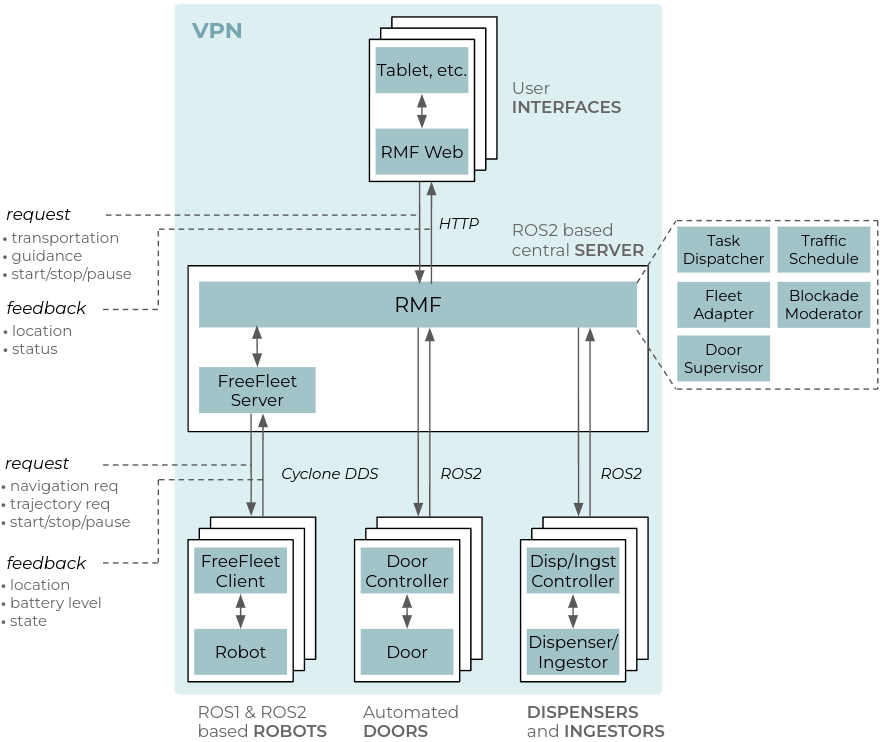

ROS2 based backend server of the application, including RMF & FF server setup, traffic maps and RMF GUI configurations

# Overview
Figure below shows the architecture of our deployed system. The setup consists of
* robots
* automated doors
* user interface devices, such as tablets
* dispensers and ingestors, which are used to place and retrieve objects from the robot respectively
* and RMF, orchestrating the whole setup. 

All devices are connected via Virtual Private Network (VPN). FreeFleet is used as the fleet manager. Structurally FreeFleet is segregated to a central server and clients, a client per each robot. The server is responsible for mediating navigation requests from RMF and providing feedback to RMF via aggregating the state of the whole fleet. The FreeFleet client passes navigation requests from the server to the driver of the local robot (ROS Navigation) and provides feedback of the robot’s state. Both RMF and the FreeFleet server are running on a dedicated PC. FreeFleet server and clients communicate purely via Cyclone DDS, thus the server can simultaneously manage both ROS1 and ROS2 based robots. Each door, dispenser and ingestor is equipped with a custom controller ([door controller](https://github.com/project-covsg24/card_swipe_py); [tablet-based dispenser](https://github.com/project-covsg24/rmf_dispenser_ingestor_tools)) that accepts commands from and sends feedback to RMF. Finally, RMF Web is utilized as a graphical user interface, mostly deployed on tablets via a web browser.

<p align="center">
  
</p>

# Server Setup Instructions
Works on ROS 2 Foxy (CycloneDDS recommended) on Ubuntu 20.04

```bash
sudo apt install ros-foxy-rmw-cyclonedds-cpp
sudo apt-get install python3-pip
sudo apt install python3-rosdep
sudo rosdep init
rosdep update
```

Setup your computer to accept Gazebo packages from packages.osrfoundation.org.

```bash
sudo apt update
sudo apt install -y wget
sudo sh -c 'echo "deb http://packages.osrfoundation.org/gazebo/ubuntu-stable `lsb_release -cs` main" > /etc/apt/sources.list.d/gazebo-stable.list'
wget https://packages.osrfoundation.org/gazebo.key -O - | sudo apt-key add -
```

Install all non-ROS dependencies of RMF packages,

```bash
sudo apt update && sudo apt install \
  git cmake python3-vcstool curl \
  qt5-default \
  python3-shapely python3-yaml python3-requests \
  -y

sudo apt-get install python3-colcon*
pip3 install pyproj
```

Install this repository

```bash
git clone --recursive https://github.com/project-covsg24/covsg24_fleet_backend
```

Ensure all ROS 2 prerequisites are fulfilled,

```bash
cd <your-catkin-workspace>
rosdep install --from-paths src --ignore-src --rosdistro foxy -yr
```

Build the packages

```bash
source /opt/ros/foxy/setup.bash
colcon build --packages-skip rmf_building_sim_ignition_plugins
```

Install RMF Panel Dashbaord

```bash
python3 -m pip install flask-socketio
pip install fiona
pip install rtree

colcon build --packages-select rmf_demos_panel
```

# Usage examples
## Running the server in hospital's ICU area configuration.

First make sure that server is using CycloneDDS
```bash
export RMW_IMPLEMENTATION=rmw_cyclonedds_cpp
```

### With Real Robot
With a real robot that's all you need to set up on the server's side
```bash
ros2 launch covsg24_fleet_server fleet_in_hospital_icu.launch.xml
```

Then launch a client setup on, e.g., TIAGo or any supported robot(s) ([setup instructions](https://github.com/project-covsg24/covsg24_fleet_client)):
```bash
roslaunch covsg24_fleet_client tiago_free_fleet_client.launch
```

### Simulation
If the robot is running in ROS1 simulation then:
```bash
ros2 launch covsg24_fleet_server fleet_in_hospital_icu.launch.xml use_sim_time:=true
```
and set up the ROS1-ROS2 bridge (needed to propagate /clock topic across the system). This example is based on ***ROS2 Foxy*** and ***ROS1 Noetic***:
```bash
sudo apt install ros-foxy-ros1-bridge

# First source ROS1
source /opt/ros/noetic/setup.bash

# Then source ROS2
source /opt/ros/foxy/setup.bash

# If ROS1 and ROS2 are running on different machines then change "localhost" to appropriate ROS1 master ip
export ROS_MASTER_URI=http://localhost:11311

# Run the bridge
ros2 run ros1_bridge dynamic_bridge
```

### ROS1-based simulation with ROS2 infrastructure plugins

The hospital simulation contains doors that RMF can control. Each door in gazebo has a plugin that communicates via ROS2. So even if the robot is launched via ROS1, the door plugins need the ROS2 environment variables also, hence when running the sim:

```bash
export RMW_IMPLEMENTATION=rmw_cyclonedds_cpp
source /opt/ros/foxy/setup.bash
source /opt/ros/foxy/setup.bash
source <your-ros2-colcon-workspace>/install/setup.bash
source <your-ros1-catkin-workspace>/devel/setup.bash
export GAZEBO_PLUGIN_PATH="/<full-path-to-your-ros2-colcon-workspace>/install/rmf_building_sim_gazebo_plugins/lib/rmf_building_sim_gazebo_plugins"

roslaunch covsg24_fleet_client robotont_in_hospital_l2.launch
```

### Command the Robot via web GUI
Just open up the browser and go to `https://open-rmf.github.io/rmf-panel-js/`. Or use the RMF Web GUI ([setup instructions](https://github.com/project-covsg24/rmf-web))

<br/> 
